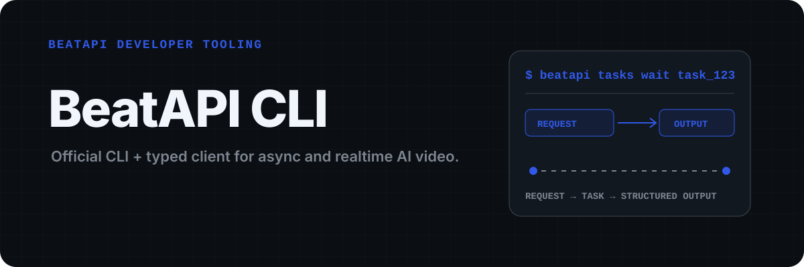
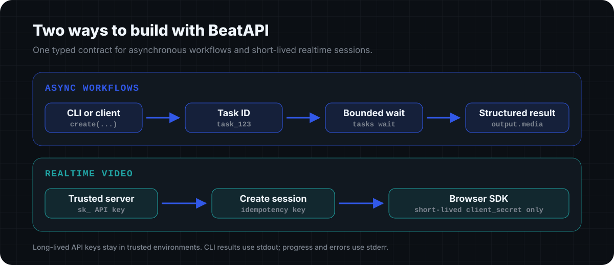

<p align="center">
  
</p>

<p align="center">
  <a href="https://www.npmjs.com/package/beatapi"><strong>CLI package</strong></a> ·
  <a href="https://www.npmjs.com/package/beatapi-client"><strong>TypeScript client</strong></a> ·
  <a href="https://docs.beatapi.io/"><strong>Documentation</strong></a> ·
  <a href="https://beatapi.io/dashboard/apikeys"><strong>Create an API key</strong></a>
</p>

# BeatAPI CLI and TypeScript Client

Official developer tooling for BeatAPI's image, video, Effect, workflow, and
Realtime APIs. Use the CLI from terminals, scripts, and AI agents, or use the
typed client directly from JavaScript and TypeScript applications.

The repository publishes two npm packages from one reviewed OpenAPI contract:

| Package | Best for | Install |
| --- | --- | --- |
| [`beatapi`](https://www.npmjs.com/package/beatapi) | Terminals, shell scripts, CI, and agents | `npm install --global beatapi` |
| [`beatapi-client`](https://www.npmjs.com/package/beatapi-client) | JavaScript and TypeScript services | `npm install beatapi-client` |

## Start in three commands

Node.js 20.19+ or 22.12+ is required.

```bash
npm install --global beatapi
beatapi auth login
beatapi workflows list
```

`auth login` reads the API key through hidden terminal input, validates it with
`GET /v1/usage`, and stores it in the operating-system credential manager. The
CLI does not accept API keys as command-line arguments and never prints them.

For CI, containers, and short-lived shells, use an environment variable instead:

```bash
export BEATAPI_API_KEY="sk_your_key"
beatapi auth status
```

Environment credentials take precedence over a saved credential.

## One contract, two execution paths

<p align="center">
  
</p>

The asynchronous path returns a task immediately and lets callers poll for a
terminal state. The Realtime path creates a short-lived browser session from a
trusted server and exposes only its one-time `client_secret` to the browser SDK.

## Create and wait for an asynchronous task

Create `music-video.json`:

```json
{
  "images": ["https://media.example.com/reference.png"],
  "audio_url": "https://media.example.com/song.mp3",
  "prompt": "Cinematic nighttime performance with light trails.",
  "language": "en",
  "resolution": "720p",
  "compose_mode": "auto"
}
```

Submit the workflow and wait for its result:

```bash
beatapi music-video create --file ./music-video.json
beatapi tasks wait task_123 --interval 7000
```

Command results are formatted JSON on stdout. Polling progress and errors use
stderr, so output remains pipeable to `jq`, files, and automation systems.

## Use the typed client

```bash
npm install beatapi-client
```

```ts
import { BeatAPIClient, BeatAPIError } from "beatapi-client";

const beatapi = new BeatAPIClient({
  apiKey: process.env.BEATAPI_API_KEY,
});

try {
  const task = await beatapi.createEcommerceVideoTask({
    images: ["https://media.example.com/product.png"],
    duration: 15,
    prompt: "Fast vertical product launch ad.",
    aspect_ratio: "9:16",
  });

  const result = await beatapi.waitForTask(task.id, {
    intervalMs: 7_000,
    onUpdate: ({ status }) => console.error(status),
  });

  console.log(result.output?.media);
} catch (error) {
  if (error instanceof BeatAPIError) {
    console.error(error.code, error.requestId);
  }
  throw error;
}
```

The client covers model and Effect discovery, image and video task creation,
versioned Effect tasks, workflow discovery, usage, file upload, music-video
automatic and manual composition, ecommerce-video tasks, task polling, webhook
CRUD, and Realtime session create/get/close. Its request and response types are
generated from the reviewed public OpenAPI snapshot.

```ts
const models = await beatapi.listGenerationModels();
const imageTask = await beatapi.createImageTask({
  model: "nano-banana",
  prompt: "Editorial product photograph on warm stone.",
});
const videoTask = await beatapi.createVideoTask({
  model: "seedance-2-mini",
  prompt: "Slow cinematic orbit at sunrise.",
});
```

Retries are bounded and opt-in. Task waiting can retry transient network and
retryable server failures while preserving BeatAPI error codes, HTTP status,
request IDs, details, and `Retry-After` information.

## Create a Realtime session

Create Realtime sessions only from a trusted terminal or server:

```bash
beatapi realtime sessions create --duration 60 \
  --origin https://app.example.com \
  --idempotency-key rt_checkout_123
```

The returned `client_secret` is short lived and may be handed to the browser
SDK. Never expose a long-lived `sk_` API key in browser code. The browser SDK
owns camera access, WebRTC, and media rendering. See the
[Realtime Video guide](https://docs.beatapi.io/realtime-video).

## Command map

```text
beatapi auth login
beatapi auth status
beatapi auth logout

beatapi workflows list
beatapi models list
beatapi usage
beatapi files upload ./input.mp3

beatapi images create --file ./image.json
beatapi videos create --file ./video.json
beatapi effects list --output-type video
beatapi effects get EFFECT
beatapi effects create --file ./effect.json --idempotency-key effect_123

beatapi music-video create --file ./music-video.json
beatapi music-video shots edit TASK SHOT --prompt "New direction"
beatapi music-video shots edit TASK SHOT --file ./shot-edit.json
beatapi music-video shots media TASK SHOT
beatapi music-video compose TASK --shot SHOT_1 --shot SHOT_2

beatapi ecommerce-video create --file ./ecommerce-video.json

beatapi realtime sessions create --duration 60 \
  --origin https://app.example.com \
  --idempotency-key rt_checkout_123
beatapi realtime sessions get SESSION
beatapi realtime sessions close SESSION

beatapi tasks get TASK
beatapi tasks wait TASK --interval 7000 --attempts 120

beatapi webhooks list
beatapi webhooks create --file ./webhook.json
beatapi webhooks get WEBHOOK
beatapi webhooks update WEBHOOK --file ./webhook-update.json
beatapi webhooks delete WEBHOOK
```

Use `beatapi --help` for the installed summary. `--json` remains an alias for
`--file` on JSON-input commands.

## Security defaults

- API keys are read from `BEATAPI_API_KEY` or an operating-system credential manager.
- macOS uses Keychain, Windows uses Credential Manager, and Linux uses Secret Service.
- Unsupported systems fail closed and instruct users to provide an environment variable; there is no plaintext fallback.
- API keys must not be committed, placed in JSON inputs, pasted into issues, or passed as command arguments.
- Webhook creation stores the one-time signing secret in the BeatAPI configuration directory with file mode `0600`; command output returns `secret_file`, not the secret.
- Realtime `client_secret` values are returned only on create. Treat terminal output and CI logs containing them as sensitive, and close unused sessions.

Set `BEATAPI_CONFIG_DIR` when a container or automation environment needs a
custom secure location. See [SECURITY.md](./SECURITY.md) for reporting guidance.

## Contract and development

```bash
npm ci
npm run contract:check
npm run check:generated
npm test
npm run verify
```

Important scripts:

- `npm run contract:sync` copies the reviewed public contract snapshot.
- `npm run generate:types` regenerates TypeScript definitions.
- `npm run check:generated` proves generated definitions are current.
- `npm run verify` runs contract, type, test, build, and package checks.

The canonical private contract is maintained in the BeatAPI product repository.
This public repository contains only its reviewed, publication-safe snapshot.
See [CONTRIBUTING.md](./CONTRIBUTING.md) before changing behavior.

## Publishing

GitHub Actions verifies every pull request. Publishing is triggered by a GitHub
release or manually through the release workflow after the repository
environment contains an `NPM_TOKEN` secret. The workflow skips package versions
that already exist, so a partial release can be rerun safely.

Release steps and ownership prerequisites are documented in
[`docs/releasing.md`](./docs/releasing.md).

## License

MIT
